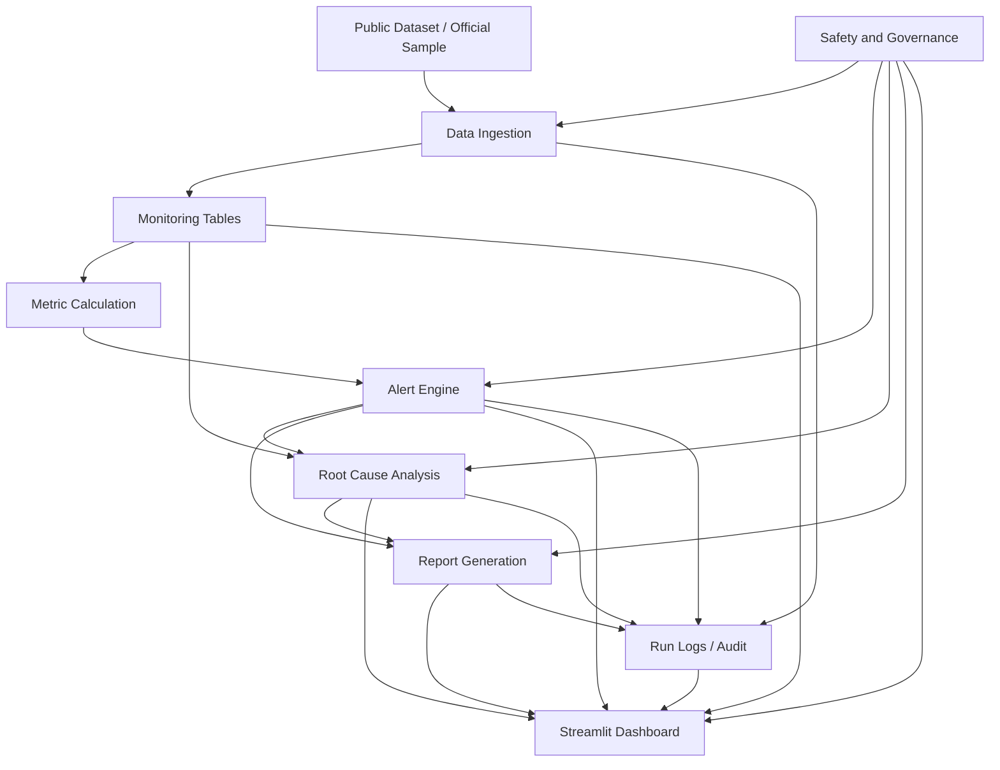
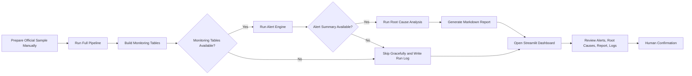

# Workflow Mermaid Diagrams

## System Architecture Diagram

```mermaid
flowchart TD
    A["Public Dataset / Official Sample"] --> B["Data Ingestion"]
    B --> C["Monitoring Tables"]
    C --> D["Metric Calculation"]
    D --> E["Alert Engine"]
    C --> F["Root Cause Analysis"]
    E --> F
    E --> G["Report Generation"]
    F --> G
    G --> H["Streamlit Dashboard"]
    E --> H
    F --> H
    C --> H
    B --> I["Run Logs / Audit"]
    E --> I
    F --> I
    G --> I
    I --> H
    J["Safety and Governance"] --> B
    J --> E
    J --> F
    J --> G
    J --> H
```

## Analysis Workflow Diagram

```mermaid
flowchart LR
    A["Prepare Official Sample Manually"] --> B["Run Full Pipeline"]
    B --> C["Build Monitoring Tables"]
    C --> D{"Monitoring Tables Available?"}
    D -- "Yes" --> E["Run Alert Engine"]
    D -- "No" --> L["Skip Gracefully and Write Run Log"]
    E --> F{"Alert Summary Available?"}
    F -- "Yes" --> G["Run Root Cause Analysis"]
    F -- "No" --> L
    G --> H["Generate Markdown Report"]
    H --> I["Open Streamlit Dashboard"]
    I --> J["Review Alerts, Root Causes, Report, Logs"]
    J --> K["Human Confirmation"]
    L --> I
```
